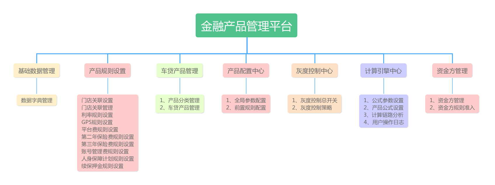

[TOC]

## 系统概述

车金融-金融产品管理平台

相关链接：http://conf.op.mljr.com/pages/viewpage.action?pageId=15573335
API文档：http://conf.op.mljr.com/pages/viewpage.action?pageId=15574896


[]

## 目录划分

### 1. heil-common

公共模块

### 2. heil-dao

+ entity：存放mapper实体，
>(1)、需要继承BaseEntity基类
(2)、增加swagger注解以及oval校验注解
(3)、添加javadoc注释实体字段
(4)、对于getter/settter可以通过lombok；

+ form：封装view视图查询条件，需要继承BaseForm类，同时添加swagger、lombok注解。
+ mapper：与数据库交互层，需要继承BaseMapper基类

### 2. heil-service

service接口、实现类，注意开发功能模块放倒各自模块目录
对于新增、修改、删除操作，一定记录操作日志。

### 3. heil-web

restfulApi接口，增加swagger注解。

## 部署规范

1. 上线前，需要基于master分支，打包release版本，release版本不断递增，同事修改pom.xml版本号。
2. 开发分支时，可以打出dev版本。

## 开发注意事项

+ restfulApi要使用Result<T>封装，该Result类提供相关静态方法，如：Result.suc()、Result.fail()。
+ 查询实体form类，如果属于通用规则类，要继承BaseForm类；
+ mapper接口要继承BaseMapper。
+ 分页查询接口，要使用PageVO<T>封装查询结果，PageForm<T>封装查询form类。
+ 相关接口都要写注释，不要懒省事。
+ controller类的相关api接口参照GpsRuleController类，即以*Record结尾。
+ service层如果需要打印日志，增加注解@LogMonitor；如果对于保存操作需要基于oval注解校验，增加@OvalValidator。
+ facade与web层交互，封装service交互

## service接口定义规范

```java
/**
 * @description: GPS规则配置Service
 * @Date : 下午5:47 2018/2/4
 * @Author : 石冬冬-Heil Hitler(dongdong.shi@mljr.com)
 */
public interface GpsRuleService {
    /**
     * 分页加载数据
     * @param form
     * @return
     */
    Result<PageVO<GpsRule>> loadRecords(PageForm<GpsRuleForm> form);
    /**
     * 查询实体对象
     * @param id
     * @return
     */
    Result<GpsRule> queryRecord(Integer id);
    /**
     * 保存实体对象
     * @param record
     * @return
     */
    Result<String> saveRecord(GpsRule record);
    /**
     * 删除对象
     * @param id
     * @return
     */
    Result<String> deleteRecord(Integer id);
}

```

## controller定义规范

```java
/**
 * @description: GPS规则配置
 * @Date : 下午6:15 2018/2/4
 * @Author : 石冬冬-Heil Hitler(dongdong.shi@mljr.com)
 */
@RestController
@RequestMapping("/gpsRule")
public class GpsRuleController {
    @Autowired
    private GpsRuleService gpsRuleService;
    /**
     * 分页加载数据
     * @param form
     * @return Result<PageVO<GpsRule>>
     */
    @RequestMapping(value = "/loadRecords",method = {RequestMethod.POST})
    @ResponseBody
    public Result<PageVO<GpsRule>> loadRecords(PageForm<GpsRuleForm> form){
        return this.gpsRuleService.loadRecords(form);
    }
    /**
     * 查询详情
     * @param id
     * @return Result<GpsRule>
     */
    @RequestMapping(value = "/queryRecord/{id}",method = {RequestMethod.GET})
    @ResponseBody
    public Result<GpsRule> queryRecord(@PathVariable Integer id){
        return this.gpsRuleService.queryRecord(id);
    }
    /**
     * 删除
     * @param id
     * @return Result<String>
     */
    @RequestMapping(value = "/deleteRecord/{id}",method = {RequestMethod.GET})
    @ResponseBody
    public Result<String> deleteRecord(@PathVariable Integer id){
        return this.gpsRuleService.deleteRecord(id);
    }
    /**
     * 保存
     * @param record
     * @return Result<String>
     */
    @RequestMapping(value = "/saveRecord",method = {RequestMethod.POST})
    @ResponseBody
    public Result<String> saveRecord(GpsRule record){
        return this.gpsRuleService.saveRecord(record);
    }
}
```